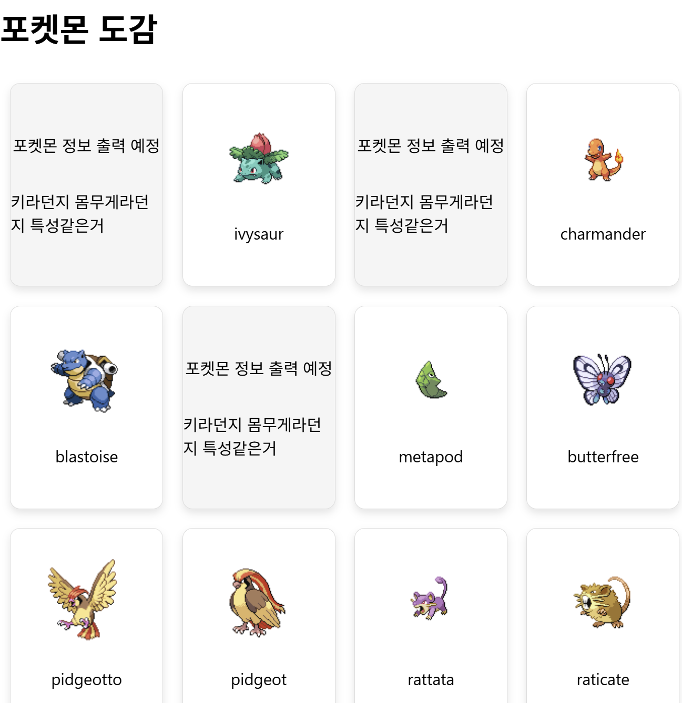

## 05.01

- 포켓몬 API가져오는거!
- 클릭시 카드뒤집는 느낌으로!
  
  

## 05.03

- 포켓몬 API에서 한글가져오기
- 스크롤 일정위치에 오면 추가데이터 불러오는거
- 카드정보가 많을경우에 스크롤생성
- 데이터가 지연될때 정보불러오는 중이라는 문구나오게!
  

## 05.04

- 그림자 맞추기 게임 (직접입력방식/4지선다형)
- 정답표시화면에서는 컬러로 나오게

  
  

  
  

## 05.10

- 도감쪽 이미지 고화질
- 헤더, 푸터
- UI

## 05.11

- 그림자게임 수정

## 05.12

- 테스트를 하면서 보이는 오류들 수정
- 승률 %, 그림자 한번더 보이는 현상, 배경, ...

## 05.13

- 검색과 정렬기능 추가
